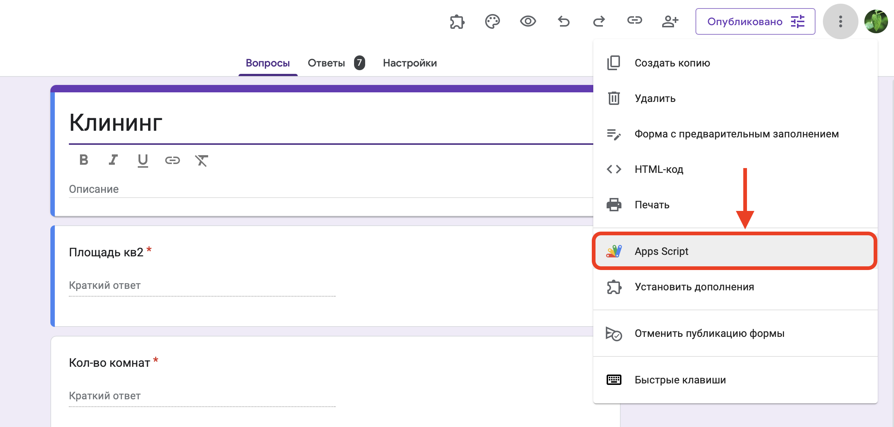
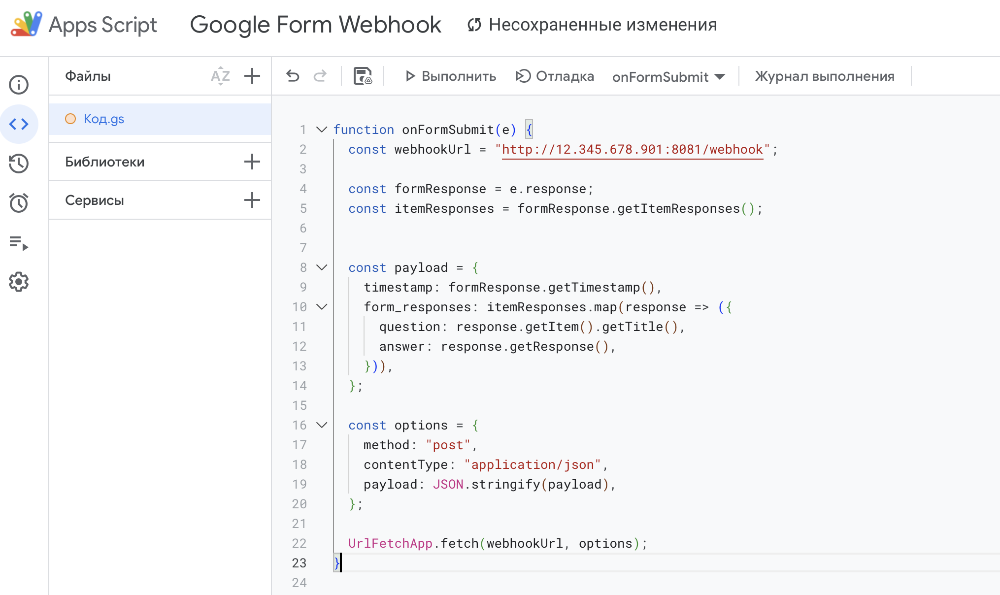
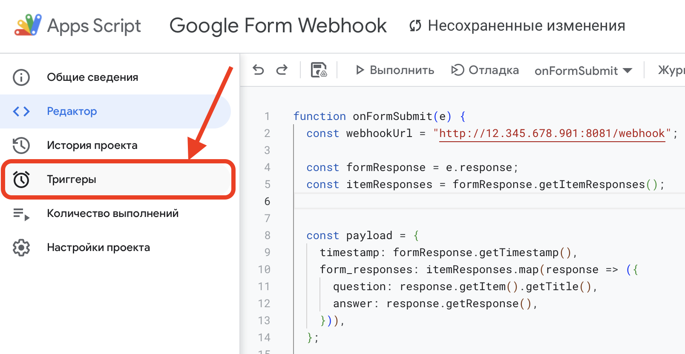
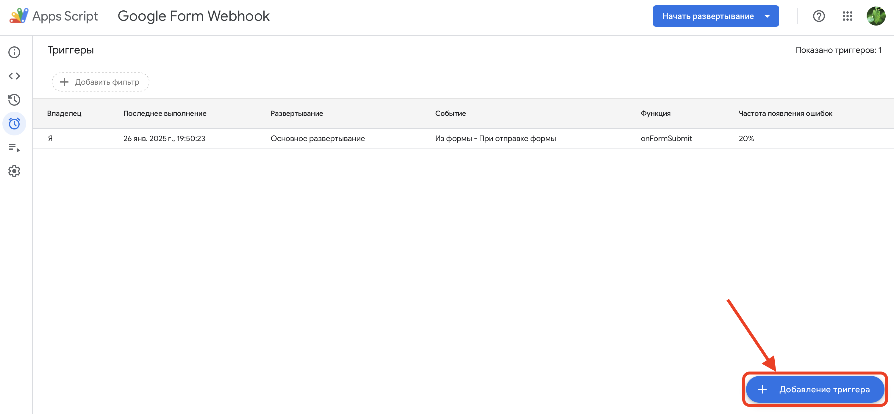
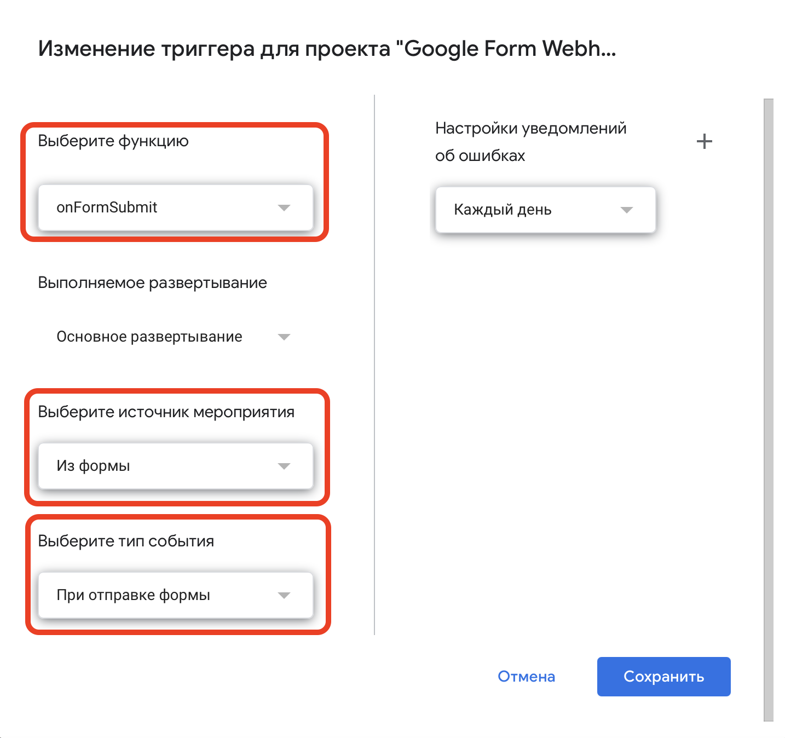
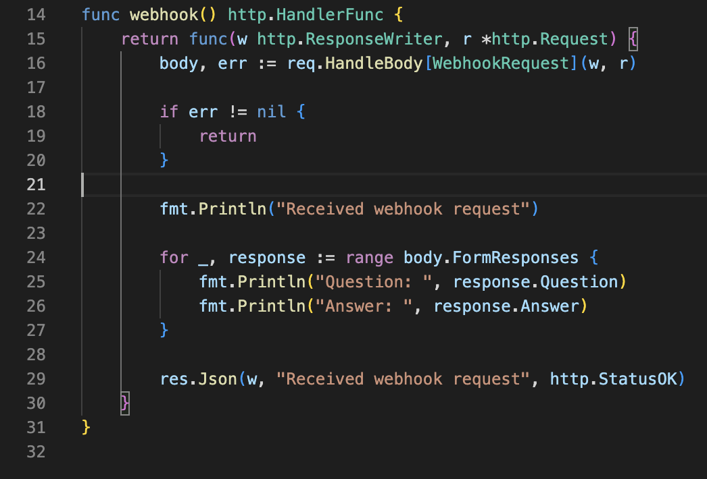

# Golang Google Forms Webhook

This project is a webhook server written in Go that processes Google Forms submissions. It listens for incoming HTTP POST requests from Google Forms and handles the data accordingly.

## Features
- **Retrieving data**: Retrieving data from the form as soon as the user has filled out and submitted the form

## Requirements
- Go (version specified in `go.mod`)
- Docker and Docker Compose

## Installation
1. Clone the repository:
```sh
git clone https://github.com/altynbek07/golang-google-forms-webhook.git
```

2. Navigate to the project directory:
```sh
cd golang-google-forms-webhook
```

6. Run the Application with Docker:

   Ensure Docker and Docker Compose are installed, then execute:

```sh
docker-compose up --build
```


## Usage
1. Publish your project on your server. When you run the Application with Docker (`docker compose up`) it starts the server and listens on the default port 8081 (you can change it in the `docker-compose.yml` file):
    ```sh
    google_forms_webhook_app  | Server is listening on port 8081
    ```

    Make sure your project is available at http://yourserver:8081 (The text “404 page not found” may appear there, but that's normal)

2. Now we need to customize on the Google Forms side. Go to [Google Forms](https://docs.google.com/forms/) and create your form. After creating your form, click on **Three Dots** > **Apps Script**:
    

3. Paste this code into the code input field:
    ```javascript
    function onFormSubmit(e) {
        const webhookUrl = "http://yourserver:8081/webhook";

        const formResponse = e.response;
        const itemResponses = formResponse.getItemResponses();
        

        const payload = {
            timestamp: formResponse.getTimestamp(),
            form_responses: itemResponses.map(response => ({
            question: response.getItem().getTitle(),
            answer: response.getResponse(),
            })),
        };

        const options = {
            method: "post",
            contentType: "application/json",
            payload: JSON.stringify(payload),
        };

        UrlFetchApp.fetch(webhookUrl, options);
    }
    ```
    Replace the string `“http://yourserver:8081/webhook”` with your server link where your project is located and save
    

4. Now we need to bind the trigger. Open Triggers (clock icon) and create a new trigger.
    

    

    This is where you have to put these parameters:
     - **Function to Run**: onFormSubmit
     - **Event Source**: From form
     - **Type of event**: On form submit

    
     
5. All of them. Now you can try filling out the form. The server will process incoming form submissions and handle the data as defined in the code. In the [internal/webhook/handler.go](internal/webhook/handler.go) file, you can customize the logic to suit you. Right now it just shows the data in the console.
    
In the code where you prescribed the webhook setup, you can also get additional form fields from the `formResponse` variable and pass it to `payload`. Don't forget to add these fields to the **WebhookRequest** struct in the [internal/webhook/payload.go](internal/webhook/payload.go)

## License
This project is licensed under the MIT License. See the [LICENSE](LICENSE) file for details.